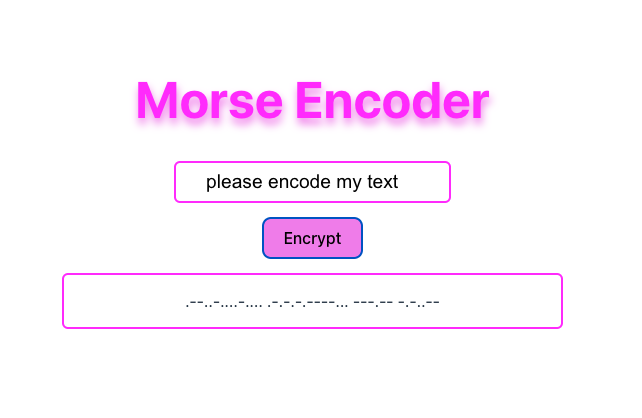

# Project Morse Code

## Morse Code

Welcome to Morse Code, a mini-project focused on converting input text into Morse code. This project was created with minimal HTML, CSS, and TypeScript. The primary goal is to demonstrate the transformation of text into Morse code. The design was provided and is consistent across the application.

## Features

- Text to Morse Code Conversion: Enter any text, and see it transformed into Morse code.

- Minimalist Design: A clean and straightforward interface.

## Technologies Used

- HTML: Basic structure of the application.

- CSS: Styling for the user interface.

- TypeScript: Logic for converting text to Morse code.

## Here's a little preview:



## Deployment

Check out the live demo on Netlify: Morse Code on Netlify

## Getting Started

To get started with this project, follow these steps:

- Clone the repository:

sh

```
git clone https://github.com/yourusername/morse-code.git
```

Navigate to the project directory:

```
cd morse-code
```

Install dependencies:

```
npm install
```

Run the development server:

```
npm run dev
```
